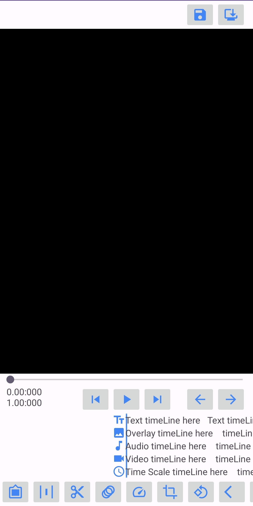

#  OSSAVE : Open Source Simple Android Video Editor (in active development)

The Idea is to create a simple pluggable video editor for android, at the same time, keeping it open source.

## Principles
* Keep It Simple
* EASY 2 USE
* ADVANCED features like AI ENABLED
* Pluggable

## Getting Started
### Prerequisites
  - Android Studio [setup](https://developer.android.com/studio/install)
  - JDK (Java Development Kit)
  - Android SDK (min and target SDK as per the project settings)
### Setup

```
git clone https://github.com/mukuldeep/OSSAVE.git
cd OSSAVE
```
Open the project in Android Studio, let Gradle sync dependencies, then build/run on an emulator or real device.

### Project Structure (High-Level)
```
OSSAVE/
├── images/               # UX and UI mockups/screenshots
├── OSSAVE/               # Main Android code (activities, fragments, etc.)
|    ├── java Code
|    |   ├── editor/      # Editing engine (FFmpegKit Operations)
|    |   ├── Log/         # Log wrapper implementation
|    |   └── utils/       # Utility classes
|    |
|    └── res
|         ├── drawables   # symbols or icons
|         └── layouts     # layouts / views
|
├── build.gradle     
└── README.md
```

### Contributing
We welcome contributions! If you're interested in helping build this open-source video editor:
  - Open an issue or feature request with a clear title and description
  - Fork the repo and set up your dev environment
  - Implement features modularly, respecting plugin patterns
  - Write tests or demos for new functionality
  - Submit a pull request and link the corresponding issue
  - Aim for clean, documented, testable code
  - Join discussions: collaboration is encouraged

## Features Overview
### Video Editing
  - Trim, split, crop, add, delete segments
  - Apply filters, FX, and adjustments
  - Reverse, stabilize, zoom, blur, freeze frames
  - Speed and reverse playback control
  - Audio handling: trim, split, delete, mute, volume, mix tracks
### Audio Editing
  - Trim, split, add, delete clips
  - Mute/volume control, mix
  - Sound effects library
  - Multi-track control and output configuration

### Image Processing
  - Trim, add, delete, duplicate
  - Crop and adjust color/brightness

### Overlays & Effects
  - Text, stickers, animated overlays
  - Linear and non-linear speed ramps
  - Transitions between clips

### AI‑Powered Tools
  - Auto-generated captions
  - Object/face detection and beautification
  - Scene-to-beat synchronization

## App Workflow
  - Import media (videos, audio, images)
  - Preview media and apply edits
  - Adjust output settings (resolution, bitrate)
  - Save project/export to local storage

## Screenshots
<p align="left">
  
</p>

## License
Distributed under the GPL‑3.0 License — open, shareable, and free for all
